  <picture>
    <source media="(prefers-color-scheme: dark)" srcset="./dark.svg">
    <source media="(prefers-color-scheme: light)" srcset="./light.svg">
    
  </picture>

  
  &nbsp;
  
  &nbsp;
  

### 👩🏼‍💻 About Me

> **Industrial and Computer Engineer:** I work in the fields of software development, data science, artificial intelligence, optimization, and industrial digitalization.

- 📍 **Location**: Nilüfer, Bursa, Türkiye
- 🎯 **Core Focus**: Data Science, Machine Learning, AI Applications, Optimization, Industrial Digitalization & Simulation.
- 💡 **Vision**: Bridging industrial engineering methodologies with modern software architectures to build intelligent, data-driven engineering systems.

---

### 🎓 Education

<table>
  <tr>
    <td width="50%" valign="top">
      <h4>🎓 Industrial Engineering (B.S.)</h4>
      <b>Balıkesir University</b> 
      • <b>Period:</b> <code>2022 – 2026</code> 
      • <b>GPA:</b> <code>3.70 / 4.00</code> <i>(Department Top Student)</i> 
      • <b>Focus:</b> Operations Research · Optimization · Supply Chain Management · Decision Analysis · Simulation
    </td>
    <td width="50%" valign="top">
      <h4>💻 Computer Engineering (Double Major)</h4>
      <b>Balıkesir University</b> 
      • <b>Period:</b> <code>2023 – 2027</code> 
      • <b>Focus:</b> Software Engineering · Data Structures & Algorithms · Artificial Intelligence · Machine Learning · Database Systems · Data Science
    </td>
  </tr>
</table>

---

### 💼 Professional Experience

#### 🏛️ Ziraat Technology — *IT Intern*

- **Scope & Contributions:** IT operations, system analysis, process improvement, and technology-driven business solutions.

#### 🥛 Eker Süt Ürünleri — *IT Intern*

- **Featured Projects:**
  - 🌟 **Demand Automation System:** Developed a digital demand management system to streamline product demand collection, tracking, and operational workflows.
  - 🌟 **Fleet & Route Management System:** Developed a distribution management solution for fleet tracking, route planning, and delivery operations across multiple distribution regions.
  - 🌟 **AI-Powered Archive System:** Developed a centralized archive for receipts and business documents, enabling structured storage, search, and AI-assisted document analysis.
- **Scope & Contributions:** System analysis, software development, database design, process digitalization, and decision-support solutions.

#### 🥤 Coca-Cola İçecek — *Production Intern*

- 🌟 **Featured Project:** Digitalization of Water Recovery Systems.
- **Project Description:** Contributed to the water recovery digitalization project from field analysis through system design and project presentations. Worked on-site to understand the existing process, supported the transition to digital meters, and contributed to the design of monitoring screens and Grafana dashboards.
- **Project Activities:** Field Analysis, Process Analysis, System & Dashboard Design, Data Monitoring, Project Meetings, and Presentations.
- **Technologies:** AWS, Grafana, Digital Metering, and Data Monitoring.
- 🛡️ **Occupational Health & Safety Project:** Prepared and presented an RFID-based Emergency Assembly Point project focused on improving personnel tracking and emergency assembly processes.
- **Technologies:** UHF RFID, RFID Tags, and Personnel Tracking.

#### 🚗 Beyçelik Gestamp Automotive — *Production Intern (Press Production Department)*

- **Scope & Contributions:** Gained hands-on experience across production, quality, logistics, R&D, and process engineering, while analyzing manufacturing workflows and shop-floor operations.
- **Manufacturing Experience:** Observed diverse manufacturing processes, material transformation methods, press operations, machining workflows, process parameters, and quality control practices.
- 🌟 **Key Achievement:** Developed an Excel VBA macro to automate the preparation of production-planning ladder diagrams, reducing repetitive manual work and improving planning efficiency and consistency.

---

### 💡 Featured Projects

#### 🌟 TÜBİTAK 2209-A University Students Research Projects Support Program

> **Project Title:** *Rich, Green & Security-Focused Vehicle Routing for ATM Cash Distribution*  
> **Project Type:** Academic Research & Development Project  
> **Academic Advisor:** *Prof. Dr. İbrahim Küçükkoç*

> **Project Description:** Developed a multi-objective rich vehicle routing model for ATM cash distribution in Balıkesir, considering operational costs, carbon emissions, and security risks. The project focuses on optimizing cash distribution routes while accounting for heterogeneous vehicles, ATM demand, vehicle capacity, and security constraints. An interactive decision-support program was developed to apply the model and evaluate different operational scenarios.

> **Methodologies:** Mixed-Integer Programming (MIP), Multi-Objective Optimization, Epsilon-Constraint Method, Rich Vehicle Routing Problem, and Pareto Analysis.

> **Technologies:** Python, Gurobi and Streamlit.

> **Key Output:** Developed an interactive decision-support program for optimizing ATM cash distribution routes and analyzing different scenarios based on cost, environmental impact, and security risk. The system enables comparison of alternative routing solutions and supports the evaluation of trade-offs between the three objectives.

#### 🤖 AI & Natural Language Processing (NLP)
- **Turkish Sentiment & YouTube Comment Analysis:** Sentiment detection and text mining on user comments using Python and NLP pipelines.
- **Machine Learning Benchmarking:** Comparative analysis of classification, regression, and clustering algorithms built in Python.

#### 🚛 Operations Research & Optimization
- **Vehicle Routing & Cargo Distribution Optimization:** Solving Vehicle Routing Problems (VRP) and logistics logistics logistics with Genetic Algorithms.
- **Production & Inventory Simulation:** Process modeling and efficiency optimization using Arena Simulation and Vensim.

---

### 🛠 Technical Skills & Tools

| Category | Tools & Technologies |
| :--- | :--- |
| **💻 Programming & Development** | `Python` `C#` `JavaScript` `React` `HTML5` `CSS3` `Excel VBA` |
| **🗄️ Databases & Data** | `MS SQL Server` `MySQL` `SQLite` |
| **🤖 Data Science & Machine Learning** | `Pandas` `NumPy` `Scikit-learn` `XGBoost` `Matplotlib` `Plotly` `Seaborn` |
| **📐 Optimization** | `Gurobi Optimizer` |
| **📈 Statistical Analysis & Quality** | `Minitab` `SPSS` |
| **🤖 Simulation & System Modeling** | `Arena Rockwell Simulation` `FlexSim` `Vensim` `MATLAB Simulink` |
| **🏭 CAD, CAM & Manufacturing** | `CATIA` `AutoCAD` `SOLIDWORKS`|
| **🔌 Electronics & Embedded Systems** | `Arduino` `Proteus` `Tinkercad` |
| **🌐 Networking** | `Cisco Packet Tracer` |
| **☁️ Cloud, Monitoring & Applications** | `AWS` `Grafana` `Streamlit` `Folium` |
| **🏢 Enterprise & Business Systems** | `SAP` `QDMS` |
| **📋 Productivity & Documentation** | `Notion` `Microsoft Office` |
| **🔧 Version Control & Collaboration** | `Git` `GitHub` |

---

  <i>✨ Thanks for visiting my GitHub profile! Feel free to explore my repositories or get in touch. ✨</i>

